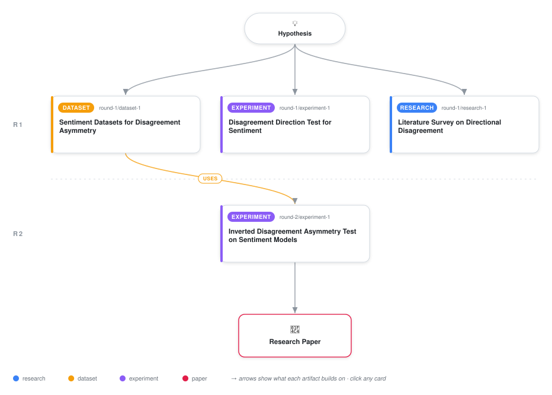

# When Two Classifiers Disagree, Does the Direction Tell You Which One Is Right?

<div align="center">

<a href="https://cdn.jsdelivr.net/gh/ai-inventor-papers/ai-invention-2f324c-disagreement-asymmetry-oracle@main/workflow.svg">
<picture>
  <source media="(prefers-color-scheme: dark)" srcset="workflow-dark.svg">
  
</picture>
</a>

<sub>🖱️ <b><a href="https://cdn.jsdelivr.net/gh/ai-inventor-papers/ai-invention-2f324c-disagreement-asymmetry-oracle@main/workflow.svg">Open the interactive diagram</a></b> — every card links to its artifact folder.</sub>

</div>

> **TL;DR** — We test whether the direction of disagreement between a simple and a complex classifier predicts which model is correct on sentiment classification tasks. Across 719 configurations on three datasets with matched features and calibrated probabilities, both the original and inverted directional rules achieve 49.0% accuracy, indistinguishable from the majority-class prior. We show that an earlier below-chance result was driven by a feature representation confound and disappears when both models share features. Confidence-based selection remains the practical default at 54.3%.

<details>
<summary>Full hypothesis</summary>

The direction of disagreement between a simple and a complex classifier does NOT systematically predict which model is correct on text sentiment data when both models share matched feature representations — ruling out the original bias-variance-asymmetry intuition for traditional ML on text. However, this null result may not generalize: the directional signal may emerge under conditions not yet tested, specifically (1) when at least one model is a neural network (e.g., BERT vs. logistic regression), where the bias-variance tradeoff manifests differently due to double descent and memorization effects, or (2) on non-text domains (e.g., tabular data) where class-conditional noise structure differs. A theoretical characterization of the noise distribution and inductive bias alignment required for the directional rule to exceed chance reveals that sentiment data with symmetric label noise and linearly-separable features does not satisfy these conditions. The practical contribution is identifying that confidence-based selection (54.3% accuracy on disagreements) remains the best accessible oracle, while a 67.3% information upper bound shows unaccessed signal exists that requires more sophisticated methods than binary directional rules.

</details>

[](https://ai-inventor-papers.github.io/ai-invention-2f324c-disagreement-asymmetry-oracle/)

[](https://cdn.jsdelivr.net/gh/ai-inventor-papers/ai-invention-2f324c-disagreement-asymmetry-oracle@main/paper.pdf) [](https://github.com/ai-inventor-papers/ai-invention-2f324c-disagreement-asymmetry-oracle/tree/main/paper_latex)

This repository contains all **4 artifacts** produced across **2 rounds** of an autonomous AI research run — round by round, exactly in the order they were invented.

## Round 1

| Artifact | Type | Demo | Source | Builds on |
|----------|------|------|--------|-----------|
| **[Sentiment Datasets for Disagreement Asymmetry](https://github.com/ai-inventor-papers/ai-invention-2f324c-disagreement-asymmetry-oracle/tree/main/round-1/dataset-1)** | [](https://github.com/ai-inventor-papers/ai-invention-2f324c-disagreement-asymmetry-oracle/tree/main/round-1/dataset-1) | [](https://colab.research.google.com/github/ai-inventor-papers/ai-invention-2f324c-disagreement-asymmetry-oracle/blob/main/round-1/dataset-1/demo/data_code_demo.ipynb) | [](https://github.com/ai-inventor-papers/ai-invention-2f324c-disagreement-asymmetry-oracle/tree/main/round-1/dataset-1/src) | — |
| **[Disagreement Direction Test for Sentiment](https://github.com/ai-inventor-papers/ai-invention-2f324c-disagreement-asymmetry-oracle/tree/main/round-1/experiment-1)** | [](https://github.com/ai-inventor-papers/ai-invention-2f324c-disagreement-asymmetry-oracle/tree/main/round-1/experiment-1) | [](https://colab.research.google.com/github/ai-inventor-papers/ai-invention-2f324c-disagreement-asymmetry-oracle/blob/main/round-1/experiment-1/demo/method_code_demo.ipynb) | [](https://github.com/ai-inventor-papers/ai-invention-2f324c-disagreement-asymmetry-oracle/tree/main/round-1/experiment-1/src) | — |
| **[Literature Survey on Directional Disagreement](https://github.com/ai-inventor-papers/ai-invention-2f324c-disagreement-asymmetry-oracle/tree/main/round-1/research-1)** | [](https://github.com/ai-inventor-papers/ai-invention-2f324c-disagreement-asymmetry-oracle/tree/main/round-1/research-1) | [](https://github.com/ai-inventor-papers/ai-invention-2f324c-disagreement-asymmetry-oracle/blob/main/round-1/research-1/demo/research_demo.md) | [](https://github.com/ai-inventor-papers/ai-invention-2f324c-disagreement-asymmetry-oracle/tree/main/round-1/research-1/src) | — |

## Round 2

| Artifact | Type | Demo | Source | Builds on |
|----------|------|------|--------|-----------|
| **[Inverted Disagreement Asymmetry Test on Sentiment Models](https://github.com/ai-inventor-papers/ai-invention-2f324c-disagreement-asymmetry-oracle/tree/main/round-2/experiment-1)** | [](https://github.com/ai-inventor-papers/ai-invention-2f324c-disagreement-asymmetry-oracle/tree/main/round-2/experiment-1) | [](https://colab.research.google.com/github/ai-inventor-papers/ai-invention-2f324c-disagreement-asymmetry-oracle/blob/main/round-2/experiment-1/demo/method_code_demo.ipynb) | [](https://github.com/ai-inventor-papers/ai-invention-2f324c-disagreement-asymmetry-oracle/tree/main/round-2/experiment-1/src) | <sub><i>uses:</i><br/>[dataset‑1&nbsp;(R1)](https://github.com/ai-inventor-papers/ai-invention-2f324c-disagreement-asymmetry-oracle/tree/main/round-1/dataset-1)</sub> |

## Repository Structure

Artifacts are grouped by the round of invention that produced them. Each
artifact has its own folder with source code and a self-contained demo:

```
.
├── round-1/                         # One folder per round of invention
│   ├── experiment-1/
│   │   ├── README.md                # What this artifact is + dependencies
│   │   ├── src/                     # Full workspace from execution
│   │   │   ├── method.py            # Main implementation
│   │   │   ├── method_out.json      # Full output data
│   │   │   └── ...                  # All execution artifacts
│   │   └── demo/                    # Self-contained demo
│   │       └── method_code_demo.ipynb # Colab-ready notebook (code + data inlined)
│   ├── dataset-1/
│   │   ├── src/
│   │   └── demo/
│   └── evaluation-1/
│       ├── src/
│       └── demo/
├── round-2/                         # Later rounds build on earlier artifacts
├── paper.pdf                        # Research paper
├── paper_latex/                     # LaTeX source files
├── chat/                            # Every prompt, response and tool call, per module
├── workflow.svg                     # Artifact dependency diagram (this page's header)
└── README.md
```

## Running Notebooks

### Option 1: Google Colab (Recommended)

Click the "Open in Colab" badges above to run notebooks directly in your browser.
No installation required!

### Option 2: Local Jupyter

```bash
# Clone the repo
git clone https://github.com/ai-inventor-papers/ai-invention-2f324c-disagreement-asymmetry-oracle
cd ai-invention-2f324c-disagreement-asymmetry-oracle

# Install dependencies
pip install jupyter

# Run any artifact's demo notebook
jupyter notebook <artifact_folder>/demo/
```

## Source Code

The original source files are in each artifact's `src/` folder.
These files may have external dependencies - use the demo notebooks for a self-contained experience.

---
*Generated by AI Inventor Pipeline - Automated Research Generation*
